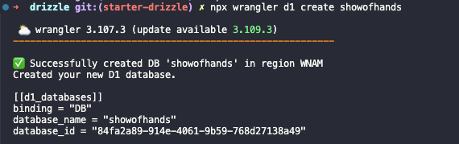

# RedwoodSDK Example: Drizzle ORM

This starter makes it easy to start up a project with database using Drizzle.

## Creating your project

Create your new project:

```shell
npx degit redwoodjs/example-drizzle my-project-name
cd my-project-name
pnpm install
```

## Running the dev server

```shell
pnpm dev
```

Point your browser to the URL displayed in the terminal (e.g. `http://localhost:5173/`). You should see a "Hello World" message in your browser.

## Deploying your app

Within your project's `wrangler.jsonc` file, replace the placeholder values. For example:

```jsonc
{
  "name": "my-project-name",
  "main": "src/worker.tsx",
  "compatibility_date": "2024-09-23",
  "compatibility_flags": ["nodejs_compat"],
  "d1_databases": [
    {
      "binding": "DB",
      "database_name": "my-project-db",
      "database_id": "YOUR-DB-ID-HERE",
      "migrations_dir": "drizzle",
    },
  ],
}
```

You'll need a [Cloudflare account](https://www.cloudflare.com/) as this starter uses Cloudflare D1 for the database.

Create a new D1 database:

```shell
npx wrangler d1 create my-project-db
```



Copy the `database_id` from the output and paste it into:

1. Your project's `wrangler.json` file
2. The `.env` file (copy from `.env.example`)

```text
CLOUDFLARE_ACCOUNT_ID=your-account-id
CLOUDFLARE_DATABASE_ID=your-database-id
CLOUDFLARE_D1_TOKEN=your-api-token
```

To get your Cloudflare credentials:

- **Account ID**: Find this under Workers & Pages in your Cloudflare dashboard
- **API Token**: Generate this under User Profile > API Tokens with the following permissions:
  - Account Settings: Read
  - D1: Edit

### Database Changes

The starter includes a basic user model in `src/db/schema.ts`:

```typescript
export const users = sqliteTable("users", {
  id: text("id").primaryKey(),
  name: text("name").notNull(),
  email: text("email").notNull().unique(),
  createdAt: integer("created_at", { mode: "timestamp" })
    .notNull()
    .default(sql`CURRENT_TIMESTAMP`),
});
```

When you need to make changes to your database schema:

1. Update your schema in `src/db/schema.ts`
2. Run `pnpm migrate:new` to create a new migration
3. Run `pnpm migrate:dev` to apply the migration

### Recommended Tools

VS Code extensions that make development easier:

- [SQLite Viewer](https://marketplace.cursorapi.com/items?itemName=qwtel.sqlite-viewer)
- [Better SQLite](https://marketplace.visualstudio.com/items?itemName=bettersqlite.better-sqlite3)

For database management, we recommend [Bee Keeper Studio](https://www.beekeeperstudio.io/).

## Further Reading

- [Drizzle Documentation](https://orm.drizzle.team)
- [Cloudflare D1 Documentation](https://developers.cloudflare.com/d1)
